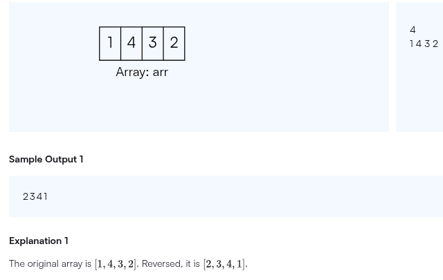
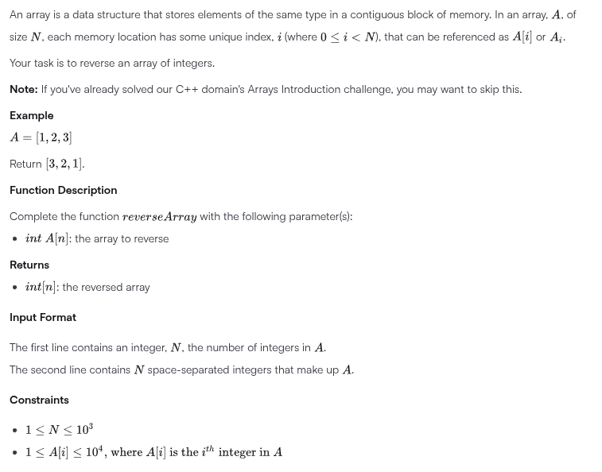

# 🧠 Algorithms and Data Structures in Java

This repository contains a collection of algorithm and data structure
implementations in Java.<br>
It is designed for learning, practice, and preparing for technical interviews,
with exercises <br>
categorized by platform, problem type, and algorithmic technique.

---

## 📁 Directory Overview

``` markdown
├── HackerRank
│   ├── Algorithms
│   │   ├── averybigsum02
│   │   │   ├── AVeryBigSum.java
│   │   │   └── subject.txt
│   │   ├── comparetriplets01
│   │   │   ├── CompareTriplets.java
│   │   │   └── subject.txt
│   │   ├── diagonaldifference03
│   │   │   ├── DiagonalDifference.java
│   │   │   └── subject.txt
│   │   └── minimaxsum04
│   │       ├── MiniMaxSum.java
│   │       └── subject.txt
│   └── DataStructures
│       ├── ReverseArray.java
│       ├── sampleInput.png
│       └── subject.png
├── LeetCode
│   ├── array
│   │   ├── BuildArrayFromPermutation.java
│   │   ├── ConcatenationOfArray.java
│   │   ├── FindWordsContainingCharacter.java
│   │   ├── HowManyNumbersAreSmallerThanTheCurrentNumber.java
│   │   ├── KeyboardRow.java
│   │   ├── LenghtOfLastWord.java
│   │   ├── LongestCommonPrefix.java
│   │   ├── MinimumIndexSumOfTwoLists.java
│   │   ├── RemoveElement_27.java
│   │   ├── ShuffleTheArray.java
│   │   ├── StringMatchingInArray.java
│   │   └── TwoSum.java
│   ├── dynamicprogramming
│   │   ├── ClimbingStairs.java
│   │   └── FibonacciNumber.java
│   ├── greedyalgorithms
│   │   ├── ArrayPartition.java
│   │   └── LongestPalidrome.java
│   ├── leetcodeBeginnersGuide
│   │   ├── Fizzbuzz03.java
│   │   ├── ListNode.java
│   │   ├── MiddleOfTheLinkedList05.java
│   │   ├── NumberOfStepsToReduceANumberToZero04.java
│   │   ├── RansomNote06.java
│   │   ├── RichestCustomerWealth02.java
│   │   ├── RunningSumOfOneDArray01.java
│   │   └── TimeAndSpaceComplexOfAlgorithms.md
│   ├── ListNode.java
│   ├── sorting
│   │   └── SortColors.java
│   ├── string
│   │   └── RomantoInteger.java
│   ├── StringToInteger.java
│   └── twopointers
│       ├── FindFirstPalindromicStringInArray.java
│       ├── FindIndexOfTheFirstOccurrenceInString.java
│       ├── MergeStringsAlternately.java
│       ├── RemoveDuplicatesFromSortedArray.java
│       ├── ReverPrefixOfWord.java
│       ├── ReverseString.java
│       ├── ReverseWordsInString3.java
│       └── ValidPalindrome.java
├── Main.java
├── sortAndSearchAlgorithms
│   ├── BinarySearch02.java
│   ├── BubbleSort03.java
│   ├── InsertionSort04.java
│   ├── LinearSearch01.java
│   ├── MergeSort05.java
│   ├── README.md
│   └── SelectionSort.java
├── teorywithexamples
│   ├── bigOAnotation.md
│   ├── javaInterviewNotes.md
│   ├── Person.java
│   └── typeOfDataStructures.md
└── typesofcomplexity
    ├── Exercise01.java
    ├── Exercise02.java
    ├── Exercise03.java
    └── Exercise04.java
```

---

## 📌 HackerRank Challenges

### `HackerRank/Algorithms`

[//]: # ([`.java`]&#40;path&#41;)

| Algorithm              | File                                                                                                   | Description                                                |
|------------------------|--------------------------------------------------------------------------------------------------------|------------------------------------------------------------|
| A Very Big Sum 02      | [`AVeryBigSum subject`](src/main/java/com/daruuu/HackerRank/Algorithms/averybigsum02/subject.md)       | Sums large integers that may exceed standard data types.   |
| Compare Triplets 01    | [`Compare Triplets`](src/main/java/com/daruuu/HackerRank/Algorithms/comparetriplets01/subject.md)      | Compares scores of two players based on multiple criteria. |
| Diagonal Difference 03 | [`DiagonalDifference`](src/main/java/com/daruuu/HackerRank/Algorithms/diagonaldifference03/subject.md) | Calculates the absolute difference between                 |  the diagonals of a square matrix.
| Mini-Max Sum           | [`MiniMaxSum`](src/main/java/com/daruuu/HackerRank/Algorithms/minimaxsum04/subject.md)                 | Finds the minimum and maximum sum of 4 out of 5 integers.  |

### `HackerRank/DataStructures`

- [
  `ReverseArray`](src/main/java/com/daruuu/HackerRank/DataStructures/ReverseArray.java):
  Reverses the elements of an array.
    - Includes input/output samples:
    - 
    - 

---

## 📌 LeetCode Solutions

### `LeetCode/array`

| Algorithm                    | File                                                                                                             | Description                                                                       |
|------------------------------|------------------------------------------------------------------------------------------------------------------|-----------------------------------------------------------------------------------|
| BuildArrayFromPermutation    | [`BuildArrayFromPermutation.java`](src/main/java/com/daruuu/LeetCode/array/BuildArrayFromPermutation.java)       | Builds a new array using the permutation rule `arr[i] = arr[arr[i]]`.             |
| ConcatenationOfArray         | [`ConcatenationOfArray.java`](src/main/java/com/daruuu/LeetCode/array/ConcatenationOfArray.java)                 | Concatenates an array with itself.                                                |
| FindWordsContainingCharacter | [`FindWordsContainingCharacter.java`](src/main/java/com/daruuu/LeetCode/array/FindWordsContainingCharacter.java) | Filters words containing a specific character.                                    |
| KeyboardRow                  | [`KeyboardRow.java`](src/main/java/com/daruuu/LeetCode/array/KeyboardRow.java)                                   | Returns words that can be typed using one row of a keyboard.                      |
| LengthOfLastWord             | [`LengthOfLastWord.java`](src/main/java/com/daruuu/LeetCode/array/LengthOfLastWord.java)                         | Finds the length of the last word in a string.                                    |
| LongestCommonPrefix          | [`LongestCommonPrefix.java`](src/main/java/com/daruuu/LeetCode/array/LongestCommonPrefix.java)                   | Finds the longest common prefix of a list of strings.                             |
| MinimumIndexSumOfTwoLists    | [`MinimumIndexSumOfTwoLists.java`](src/main/java/com/daruuu/LeetCode/array/MinimumIndexSumOfTwoLists.java)       | Finds common strings with the least index sum.                                    |
| ShuffleTheArray              | [`ShuffleTheArray.java`](src/main/java/com/daruuu/LeetCode/array/ShuffleTheArray.java)                           | Shuffles an array in the form \[x1,x2,...,xn,y1,y2,...,yn] to \[x1,y1,x2,y2,...]. |
| StringMatchingInArray        | [`StringMatchingInArray.java`](src/main/java/com/daruuu/LeetCode/array/StringMatchingInArray.java)               | Finds strings that are substrings of another string.                              |
| TwoSum                       | [`TwoSum.java`](src/main/java/com/daruuu/LeetCode/array/TwoSum.java)                                             | Finds two numbers that sum to a given target.                                     |

---

### `LeetCode/dynamicprogramming`

| Algorithm       | File                                                                                                | Description                                                 |
|-----------------|-----------------------------------------------------------------------------------------------------|-------------------------------------------------------------|
| ClimbingStairs  | [`ClimbingStairs.java`](src/main/java/com/daruuu/LeetCode/dynamicprogramming/ClimbingStairs.java)   | Solves the classic "ways to climb stairs" problem using DP. |
| FibonacciNumber | [`FibonacciNumber.java`](src/main/java/com/daruuu/LeetCode/dynamicprogramming/FibonacciNumber.java) | Computes Fibonacci numbers using memoization.               |

---

### `LeetCode/greedyalgorithms`

| Algorithm         | File                                                                                                  | Description                                                   |
|-------------------|-------------------------------------------------------------------------------------------------------|---------------------------------------------------------------|
| ArrayPartition    | [`ArrayPartition.java`](src/main/java/com/daruuu/LeetCode/greedyalgorithms/ArrayPartition.java)       | Maximizes the sum of minimums in array pairs.                 |
| LongestPalindrome | [`LongestPalindrome.java`](src/main/java/com/daruuu/LeetCode/greedyalgorithms/LongestPalindrome.java) | Finds the length of the longest palindrome that can be built. |

---

### `LeetCode/twopointers`

| Algorithm                             | File                                                                                                                                     | Description                                                           |
|---------------------------------------|------------------------------------------------------------------------------------------------------------------------------------------|-----------------------------------------------------------------------|
| FindFirstPalindromicStringInArray     | [`FindFirstPalindromicStringInArray.java`](src/main/java/com/daruuu/LeetCode/twopointers/FindFirstPalindromicStringInArray.java)         | Finds the first palindrome in an array.                               |
| FindIndexOfTheFirstOccurrenceInString | [`FindIndexOfTheFirstOccurrenceInString.java`](src/main/java/com/daruuu/LeetCode/twopointers/FindIndexOfTheFirstOccurrenceInString.java) | Returns the index of the first occurrence of a substring.             |
| MergeStringsAlternately               | [`MergeStringsAlternately.java`](src/main/java/com/daruuu/LeetCode/twopointers/MergeStringsAlternately.java)                             | Alternately merges characters from two strings.                       |
| ReverPrefixOfWord                     | [`ReverPrefixOfWord.java`](src/main/java/com/daruuu/LeetCode/twopointers/ReverPrefixOfWord.java)                                         | Reverses the prefix of a word up to a given character.                |
| ReverseString                         | [`ReverseString.java`](src/main/java/com/daruuu/LeetCode/twopointers/ReverseString.java)                                                 | Reverses a character array in-place.                                  |
| ReverseWordsInString3                 | [`ReverseWordsInString3.java`](src/main/java/com/daruuu/LeetCode/twopointers/ReverseWordsInString3.java)                                 | Reverses words in a sentence but not their order.                     |
| ValidPalindrome                       | [`ValidPalindrome.java`](src/main/java/com/daruuu/LeetCode/twopointers/ValidPalindrome.java)                                             | Checks if a string is a palindrome (ignoring non-alphanumeric chars). |

---

## 📌 LeetCode Solutions

### 🔍 Sorting and Searching Algorithms

### [`sortAndSearchAlgorithms/`](src/main/java/com/daruuu/sortAndSearchAlgorithms/README.md)

| Algorithm      | File                                                                                            | Description                                                        |
|----------------|-------------------------------------------------------------------------------------------------|--------------------------------------------------------------------|
| Linear Search  | [`LinearSearch01.java`](src/main/java/com/daruuu/sortAndSearchAlgorithms/LinearSearch01.java)   | Iterates through array to find a target.                           |
| Binary Search  | [`BinarySearch02.java`](src/main/java/com/daruuu/sortAndSearchAlgorithms/BinarySearch02.java)   | Efficiently searches sorted arrays using divide and conquer.       |
| Bubble Sort    | [`BubbleSort03.java`](src/main/java/com/daruuu/sortAndSearchAlgorithms/BubbleSort03.java)       | Repeatedly swaps adjacent elements in wrong order.                 |
| Insertion Sort | [`InsertionSort04.java`](src/main/java/com/daruuu/sortAndSearchAlgorithms/InsertionSort04.java) | Builds sorted array by inserting one element at a time.            |
| Merge Sort     | [`MergeSort05.java`](src/main/java/com/daruuu/sortAndSearchAlgorithms/MergeSort05.java)         | Divides the array and merges sorted halves.                        |
| Selection Sort | [`SelectionSort.java`](src/main/java/com/daruuu/sortAndSearchAlgorithms/SelectionSort.java)     | Selects the minimum element and places it at the correct position. |

---

---

## 📘 Theoretical Notes and Interview Prep

### `teorywithexamples/`

| File                      | Description                                               |
|---------------------------|-----------------------------------------------------------|
| `bigOAnotation.md`        | Time and space complexity fundamentals.                   |
| `javaInterviewNotes.md`   | Java-specific interview questions and answers.            |
| `typeOfDataStructures.md` | Categorization and explanation of common data structures. |
| `Person.java`             | Simple class for OOP and theory demonstration.            |

---

## ⏱️ Time & Space Complexity Exercises

### `typesofcomplexity/`

| Exercise                               | Description                                                                     |
|----------------------------------------|---------------------------------------------------------------------------------|
| `Exercise01.java` to `Exercise04.java` | Simple Java programs designed to analyze and reason about algorithm complexity. |

---

## ✅ Unit Testing with JUnit 5

Tests are located in the `src/test/java/...` directory, organized to mirror the
structure of your main code.

### Features:

- Written using **JUnit 5**
- Each class has its corresponding test class
- Assertions for correctness and edge cases

### Run all tests:

``` bash
    mvn test
```

--- 
